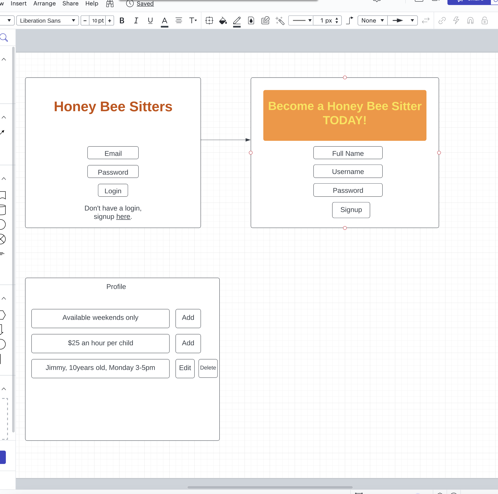

# Honey_Bee_Sitters

<!--Table of Contents-->
Table of Contents
<ol>
 <li>
  <a href= "#Honey_Bee_Sitters">Honey Bee Sitters</a>
  <ul>
   <li><a href="#Built-with">Built With</a></li>
  </ul>
 
 </li>
 <li>
  <a href="#installation-instructions">Installation Instructions</a></li>
<li><a href="#wire-frame">Wire Frames</a></li>  
</ol>

<!--About the Project-->
# Honey Bee Sitters

Honey Bee Sitters App is an app created to help caregivers find the perfect babysitting position. Users will be able to update, edit or delelte details on profile that showcase skills and experience. It allows users to show their availability and establish hourly rate per child. 

### Built With
This is a full-stack app built using Javascript and React for the frontend and Python and Django for the backend. It offers full CRUD capabilities that allows users to create, update or delete data. 

(<a href="#top">back to top</a>)

### Approach Taken

### Installation
Users will be able to go to this site (https://honeybee-sitters-backend.onrender.com) and begin to organize their babysitting schedule. 

(<a href="#top">back to top</a>)

### Wireframes
